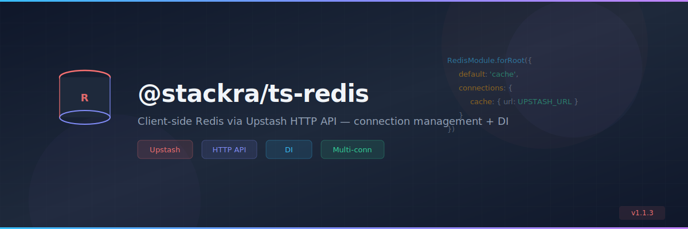

<p align="center">
  
</p>

<p align="center">
  <a href="https://www.npmjs.com/package/@stackra/ts-redis">
    
  </a>
  <a href="./LICENSE">
    
  </a>
  <a href="https://www.typescriptlang.org/">
    
  </a>
</p>

---

# @stackra/ts-redis

Client-side Redis connection management using Upstash HTTP API for Refine
applications.

## Features

- ✅ **Browser-Compatible**: Uses Upstash HTTP REST API (no Node.js required)
- ✅ **Multiple Connections**: Support for named connections (cache, session,
  etc.)
- ✅ **Dependency Injection**: Integrates with @stackra/container
- ✅ **React Hooks**: Easy-to-use hooks for React components
- ✅ **TypeScript**: Full type safety with comprehensive JSDoc
- ✅ **Production-Ready**: Error handling, retries, and timeouts
- ✅ **Zero Config**: Sensible defaults with full customization

## Installation

```bash
npm install @stackra/ts-redis @upstash/redis
# or
yarn add @stackra/ts-redis @upstash/redis
# or
pnpm add @stackra/ts-redis @upstash/redis
```

## Quick Start

### 1. Get Upstash Credentials

1. Sign up at [Upstash Console](https://console.upstash.com)
2. Create a Redis database
3. Copy the REST URL and token from the "REST API" section

### 2. Configure the Module

```typescript
// app.module.ts
import { Module } from '@stackra/container';
import { RedisModule } from '@stackra/ts-redis';

@Module({
  imports: [
    RedisModule.forRoot({
      default: 'cache',
      connections: {
        cache: {
          url: process.env.UPSTASH_REDIS_REST_URL!,
          token: process.env.UPSTASH_REDIS_REST_TOKEN!,
        },
      },
    }),
  ],
})
export class AppModule {}
```

### 3. Use in Your Code

#### In Services (with DI)

```typescript
import { Injectable } from '@stackra/container';
import { RedisService } from '@stackra/ts-redis';

@Injectable()
export class UserService {
  constructor(private readonly redis: RedisService) {}

  async cacheUser(user: User): Promise<void> {
    const connection = await this.redis.connection();
    await connection.set(
      `user:${user.id}`,
      JSON.stringify(user),
      { ex: 3600 } // Expire in 1 hour
    );
  }

  async getUser(id: string): Promise<User | null> {
    const connection = await this.redis.connection();
    const data = await connection.get(`user:${id}`);
    return data ? JSON.parse(data) : null;
  }
}
```

#### In React Components (with Hooks)

```typescript
import { useRedis } from '@stackra/ts-redis';
import { useEffect, useState } from 'react';

function UserProfile({ userId }: { userId: string }) {
  const redis = useRedis();
  const [user, setUser] = useState<User | null>(null);

  useEffect(() => {
    async function loadUser() {
      const connection = await redis.connection();

      // Try cache first
      const cached = await connection.get(`user:${userId}`);
      if (cached) {
        setUser(JSON.parse(cached));
        return;
      }

      // Fetch and cache
      const user = await fetchUser(userId);
      await connection.set(
        `user:${userId}`,
        JSON.stringify(user),
        { ex: 3600 }
      );
      setUser(user);
    }

    loadUser();
  }, [userId, redis]);

  return <div>{user?.name}</div>;
}
```

## Configuration

### Multiple Connections

Configure multiple Redis instances for different purposes:

```typescript
RedisModule.forRoot({
  default: 'cache',
  connections: {
    // Cache connection
    cache: {
      url: process.env.UPSTASH_CACHE_URL!,
      token: process.env.UPSTASH_CACHE_TOKEN!,
    },
    // Session connection
    session: {
      url: process.env.UPSTASH_SESSION_URL!,
      token: process.env.UPSTASH_SESSION_TOKEN!,
      timeout: 10000,
    },
    // Rate limiting connection
    ratelimit: {
      url: process.env.UPSTASH_RATELIMIT_URL!,
      token: process.env.UPSTASH_RATELIMIT_TOKEN!,
      enableAutoPipelining: true,
    },
  },
});
```

### Connection Options

```typescript
interface RedisConnectionConfig {
  // Required
  url: string; // Upstash Redis REST URL
  token: string; // Upstash Redis REST token

  // Optional
  timeout?: number; // Request timeout in ms (default: 5000)

  retry?: {
    retries?: number;
    backoff?: (retryCount: number) => number;
  };

  enableAutoPipelining?: boolean; // Batch commands automatically
}
```

### Retry Configuration

```typescript
{
  retry: {
    retries: 3,
    backoff: (retryCount) => {
      // Exponential backoff: 100ms, 200ms, 400ms
      return Math.min(100 * 2 ** retryCount, 1000);
    }
  }
}
```

## API Reference

### RedisService

Main service for connection management.

#### Methods

- `connection(name?: string): Promise<RedisConnection>` - Get a connection
- `disconnect(name?: string): Promise<void>` - Disconnect a connection
- `disconnectAll(): Promise<void>` - Disconnect all connections
- `getConnectionNames(): string[]` - Get configured connection names
- `getDefaultConnectionName(): string` - Get default connection name
- `isConnectionActive(name?: string): boolean` - Check if connection is active

### RedisConnection

Interface for Redis operations.

#### Basic Operations

```typescript
// Get/Set
await connection.get('key');
await connection.set('key', 'value', { ex: 3600 });

// Delete
await connection.del('key1', 'key2');

// Exists
await connection.exists('key1', 'key2');

// Expiration
await connection.expire('key', 300);
await connection.ttl('key');
```

#### Multi-Key Operations

```typescript
// Get multiple keys
const [val1, val2] = await connection.mget('key1', 'key2');

// Set multiple keys
await connection.mset({
  key1: 'value1',
  key2: 'value2',
});
```

#### Increment/Decrement

```typescript
// Increment
await connection.incr('counter');
await connection.incrby('counter', 5);

// Decrement
await connection.decr('counter');
await connection.decrby('counter', 3);
```

#### Pipeline (Batching)

```typescript
const results = await connection
  .pipeline()
  .set('key1', 'value1')
  .set('key2', 'value2')
  .get('key1')
  .del('key3')
  .exec();

console.log(results); // ['OK', 'OK', 'value1', 1]
```

#### Sorted Sets (for advanced use)

```typescript
// Add to sorted set
await connection.zadd('leaderboard', 100, 'user:1');

// Get range
const top10 = await connection.zrange('leaderboard', 0, 9);

// Remove by score
await connection.zremrangebyscore('leaderboard', 0, 50);
```

### React Hooks

#### useRedis()

Get the Redis service instance.

```typescript
const redis = useRedis();
const connection = await redis.connection('cache');
```

#### useRedisConnection(name?)

Get a specific connection (returns a Promise).

```typescript
const getConnection = useRedisConnection('cache');

useEffect(() => {
  getConnection.then(async (connection) => {
    await connection.set('key', 'value');
  });
}, [getConnection]);
```

## Common Patterns

### Cache-Aside Pattern

```typescript
async function getUser(id: string): Promise<User> {
  const connection = await redis.connection();

  // Try cache
  const cached = await connection.get(`user:${id}`);
  if (cached) {
    return JSON.parse(cached);
  }

  // Fetch from database
  const user = await db.users.findById(id);

  // Cache for 1 hour
  await connection.set(`user:${id}`, JSON.stringify(user), { ex: 3600 });

  return user;
}
```

### Distributed Locking

```typescript
async function acquireLock(
  resource: string,
  ttl: number = 10
): Promise<boolean> {
  const connection = await redis.connection();
  const lockKey = `lock:${resource}`;

  // Try to acquire lock (set if not exists)
  const acquired = await connection.set(lockKey, 'locked', {
    nx: true,
    ex: ttl,
  });

  return acquired === 'OK';
}

async function releaseLock(resource: string): Promise<void> {
  const connection = await redis.connection();
  await connection.del(`lock:${resource}`);
}
```

### Rate Limiting

```typescript
async function checkRateLimit(
  userId: string,
  limit: number = 100,
  window: number = 60
): Promise<boolean> {
  const connection = await redis.connection();
  const key = `ratelimit:${userId}`;

  const current = await connection.incr(key);

  if (current === 1) {
    // First request, set expiration
    await connection.expire(key, window);
  }

  return current <= limit;
}
```

### Session Storage

```typescript
async function saveSession(
  sessionId: string,
  data: SessionData
): Promise<void> {
  const connection = await redis.connection('session');
  await connection.set(
    `session:${sessionId}`,
    JSON.stringify(data),
    { ex: 86400 } // 24 hours
  );
}

async function getSession(sessionId: string): Promise<SessionData | null> {
  const connection = await redis.connection('session');
  const data = await connection.get(`session:${sessionId}`);
  return data ? JSON.parse(data) : null;
}
```

## Best Practices

### 1. Use Appropriate TTLs

Always set expiration times to prevent memory leaks:

```typescript
// Good
await connection.set('temp:data', value, { ex: 300 });

// Bad (no expiration)
await connection.set('temp:data', value);
```

### 2. Use Pipelines for Multiple Operations

Batch operations for better performance:

```typescript
// Good
await connection
  .pipeline()
  .set('key1', 'value1')
  .set('key2', 'value2')
  .set('key3', 'value3')
  .exec();

// Bad (3 HTTP requests)
await connection.set('key1', 'value1');
await connection.set('key2', 'value2');
await connection.set('key3', 'value3');
```

### 3. Handle Errors Gracefully

```typescript
try {
  const connection = await redis.connection();
  await connection.set('key', 'value');
} catch (error) {
  console.error('Redis error:', error);
  // Fall back to database or return cached data
}
```

### 4. Use Namespaced Keys

Organize keys with prefixes:

```typescript
// Good
`user:${userId}:profile``cache:posts:${postId}``session:${sessionId}`
// Bad
`${userId}``${postId}`;
```

### 5. Clean Up on Shutdown

```typescript
// In your app shutdown handler
await redis.disconnectAll();
```

## TypeScript Support

Full TypeScript support with comprehensive types:

```typescript
import type {
  RedisConnection,
  RedisConfig,
  RedisConnectionConfig,
  SetOptions,
  RedisPipeline,
} from '@stackra/ts-redis';
```

## Browser Compatibility

This package works in all modern browsers that support:

- Fetch API
- Promises
- ES2020 features

No polyfills required for modern browsers (Chrome 80+, Firefox 75+, Safari
13.1+, Edge 80+).

## License

MIT

## Contributing

Contributions are welcome! Please read our contributing guidelines before
submitting PRs.

## Support

- [Documentation](https://refine.dev/docs)
- [Discord](https://discord.gg/refine)
- [GitHub Issues](https://github.com/refinedev/refine/issues)

## Related Packages

- [@stackra/cache](../cache) - Multi-driver cache system
- [@upstash/redis](https://github.com/upstash/upstash-redis) - Upstash Redis
  client
